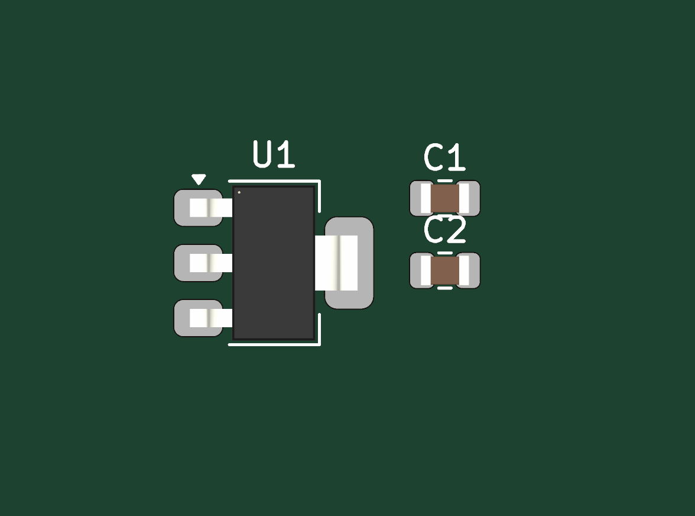
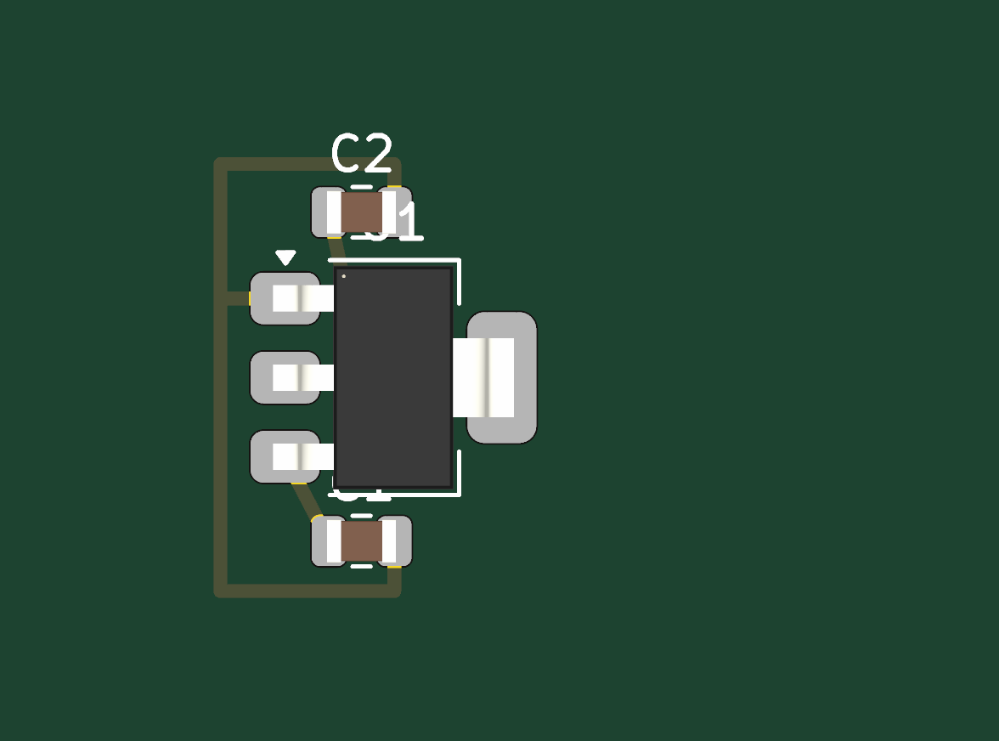

<a name="top"></a>

<div align="center">


# KiCad Agentic MCP

</div>

**AI-assisted PCB design for KiCAD 10.** Konnect is a native KiCAD plugin — a single
Rust binary — that lets Claude and other AI assistants design schematics and PCBs
through the [Model Context Protocol](https://modelcontextprotocol.io) (MCP).

**202 tools across 22 on-demand toolsets.** Schematic capture, PCB layout and
routing, ERC/DRC, design-review audits, JLCPCB part search, Freerouting, reference
circuits, and a full manufacturing export pipeline — with bundled skills and agents
that teach Claude KiCAD conventions out of the box.

> **This repository is KiCad Agentic MCP**, an agentic fork of
> [mixelpixx/Konnect](https://github.com/mixelpixx/Konnect) v0.2.2, under the same
> AGPL-3.0 licence. On top of Konnect's tool surface it adds an MCP gateway, a plan
> IR with a deterministic executor, evidence handles, task state and a local-model
> runtime. The server binary is still called `konnect`.
>
> **Status: v1.1.0.** What it measures, what it misses and what it does not cover
> are in [RELEASE_NOTES.md](RELEASE_NOTES.md); every figure quoted below traces to
> [docs/benchmark.md](docs/benchmark.md). Issues and PRs are welcome — see
> [CONTRIBUTING.md](CONTRIBUTING.md) and the
> [naming conventions](docs/NAMING_CONVENTIONS.md).

## What one prompt does

<table>
<tr><th width="50%">Before</th><th width="50%">After</th></tr>
<tr>
<td></td>
<td></td>
</tr>
</table>

The starting board, the prompt and the setup steps are committed in
[`examples/demo/`](examples/demo/), so this is reproducible rather than
illustrative. Both images are `kicad-cli` renders of the board file, same frame,
same zoom — the left one before the prompt, the right one after it.

**KiCad's verdict on the result, not ours:** 5 unconnected items before, **0**
after; 11 track segments; silkscreen warnings and no errors. Run twice from the
same starting state, and it reproduced — same circuit, same verdict, different
coordinates.

**Two numbers, because they measure two different things.** The board changes
themselves — both placements, eleven traces, the saves — land in **under a
second**: 0.69 s and 0.77 s of Konnect time across the two runs, the slowest
single write 0.07 s. The prompt, end to end, took **6 to 7 minutes** (377 s and
424 s), because that is how long the model takes to look, decide and route one
segment per turn. The product is fast; the conversation is not, and quoting only
the first number would be quoting the flattering half.

The full runs — what was called, in what order, and where the time went — are in
[`docs/launch/demo-run-2.md`](docs/launch/demo-run-2.md) and
[`demo-run-3.md`](docs/launch/demo-run-3.md).

## Quick start

Five steps from the release page to a change KiCAD itself confirms. Walked on a
machine that had never had Konnect installed; the record, including what went
wrong, is [docs/launch/first-run-walk.md](docs/launch/first-run-walk.md).

What that walk measured: **about nine clicks and dialogs** between launching
KiCAD and an installed plugin, two KiCAD restarts, and a first task that came
back in **108 ms**. The total is dominated by how fast you click, so it is not
quoted as a number.

**Before you start** you need KiCAD 10 (tested against 10.0.3) and an MCP client
— Claude Desktop, Claude Code, or anything else that speaks MCP. Nothing else:
no Node, no Python, no package tree. Windows is the most-tested platform; see
[Requirements](#requirements) for where macOS and Linux stand.

**1 — Download the plugin package.** From
[Releases](https://github.com/nevenfo/kicad-agentic-mcp/releases), take
`konnect-pcm-v<version>-windows.zip` (or `-macos.zip` / `-linux.zip`). The
`konnect-pcm-*` assets are the KiCAD plugin packages; the other archives are
standalone server binaries you do not need for this path.

**2 — Install it.** KiCAD 10 → **Plugin and Content Manager** → **Install from
File…** → pick the zip. It installs the moment you select the file — the *Apply
Pending Changes* button stays greyed out and there is nothing further to
confirm. Restart KiCAD.

**3 — Turn on the KiCAD API.** *Preferences → Plugins* → check **Enable KiCad
API**, then restart KiCAD. KiCAD ships this **off**, and every PCB tool here
talks to KiCAD through it. Schematic editing and exports work without it; live
board editing does not. After the restart the same page should read
`Listening on ipc://…`.

**4 — Point your MCP client at the server.** After a PCM install the binary
lives in your KiCAD documents folder:

```
C:\Users\<YOU>\Documents\KiCad\10.0\3rdparty\plugins\com_github_mixelpixx_konnect\bin\konnect.exe
```

Put that path in your client's MCP config — `%APPDATA%\Claude\claude_desktop_config.json`
for Claude Desktop, a `.mcp.json` in your project root for Claude Code. Copy-paste
versions of both are in [examples/](examples/), and the full snippets are
[further down](#setup-with-claude-desktop). Restart the client; `konnect` should
report **21 tools** at startup. That is the whole starter kit — the rest of the
catalogue loads on demand, or is called through the gateway without ever
appearing in `tools/list`.

**5 — Give it something to do**, with a KiCAD project open. For example:

> *Add a 3.3 V LDO regulator subcircuit to my schematic and run ERC on it.*

The reply should name the parts it placed — a regulator, its input and output
capacitors — and carry an ERC result that came from `kicad-cli`, not from the
model. Open the schematic in KiCAD: the symbols are there.

**Check the install itself** at any point: open a project (KiCAD's PCB editor
refuses to open without one), then **PCB Editor → Tools → External Plugins**,
where you should see **Konnect**.

### What this does not do yet

- **PCB tools need a running KiCAD** with the API on and the board open. There is
  no headless PCB path — pcbnew has none.
- **macOS binaries are not signed or notarised.** Gatekeeper stops them on first
  launch; the [macOS section](#macos) has the exact `xattr` command.
- **Linux compiles and passes CI** but has had no per-platform QA against a
  running KiCAD.
- **Symbols and footprints are placed, not authored.** Konnect searches and uses
  existing library parts; creating new ones is on the [roadmap](ROADMAP.md).

**If any of those five steps did not work for you**, that is the thing worth
reporting: [file a first-run report](https://github.com/nevenfo/kicad-agentic-mcp/issues/new?template=first-run.yml).
It takes about two minutes and it is the only way any of this gets measured on a
machine that is not the maintainer's.

## Why Konnect exists

Konnect is the successor to [KiCAD-MCP-Server](https://github.com/mixelpixx/KiCAD-MCP-Server),
a Python/TypeScript project that proved AI-driven PCB design works — and, in the
process, showed exactly where that architecture runs out of road. Konnect was built
to fix those specific problems:

**The call path was too long.** In the original server, a single tool call travels
through TypeScript, schema validation, a spawned Python subprocess, JSON over
stdin/stdout, a command router, and finally SWIG-generated C++ proxy objects before
anything touches your board. That's four language and serialization boundaries, each
with its own failure modes — subprocess lifecycle management, stdout parsing that
filters out warnings KiCAD leaks into the stream, chunked-JSON reassembly. In
Konnect, a tool call is a function call. One process, one language, no plumbing.

**The dependency surface was enormous.** Running the original means carrying Node.js
and its npm tree, Python and its pip packages, wxPython, kicad-skip, and KiCAD's
SWIG bindings — two package ecosystems plus a binding layer, every one of them a
moving target that can break an install. Konnect is one binary — 24 MB on
Windows, no interpreter, no package tree. There is nothing to install alongside
it and nothing to version-match.

**SWIG is a dead end.** The original's PCB backend depends on KiCAD's SWIG Python
bindings, which KiCAD is deprecating in favor of its IPC API. SWIG also carried
real operational scars: a zone-fill call that can segfault the backend, proxy-object
comparison bugs, and a fallback path that can silently swap backends mid-session.
Konnect talks to KiCAD 10 through the official IPC API (protobuf over NNG) — the
interface KiCAD is investing in — with real-time board edits that integrate with
KiCAD's own undo/redo.

**Schematic edits should not corrupt files.** Konnect edits `.kicad_sch` files
through its own S-expression engine with atomic writes (write, fsync, rename), UUID
preservation, and round-trip tests — no third-party schematic library with known
gaps, no text-manipulation workarounds.

**Context economy is a feature.** Serving the whole catalogue — 215 tools once
every toolset is loaded — costs **33K tokens** of context on every listing.
Konnect's router opens with a starter kit of **21 tools / 2.8K tokens** and lets
the model pull in toolsets on demand, or skip the catalogue entirely and call
tools through the gateway (`kicad_describe` / `kicad_invoke`), which never
changes `tools/list` at all — plus built-in observability (`get_recent_calls`,
`server_stats`, JSONL call logs) so the model can diagnose its own tool
failures. Those figures are measured, not estimated: see
[docs/benchmark.md](docs/benchmark.md).

The result is smaller, faster to install, aligned with where KiCAD is going, and
built for production use rather than experimentation. The original project remains
open, maintained, and useful — see [the comparison below](#relationship-to-kicad-mcp-server).

## What it does

Instead of describing changes and applying them by hand, the AI works your project
directly:

- **Place and wire schematic components** — add resistors, ICs, connectors; wire them
  together by pin name
- **Lay out the PCB** — place, move, rotate, and route footprints in real time via
  KiCAD's IPC API, with full undo/redo integration
- **Run design checks** — ERC, DRC, connectivity validation, decoupling audits,
  power-rail review, BOM health checks
- **Export production files** — Gerbers, drill, BOM, pick-and-place, 3D models, PDF
- **Search JLCPCB parts** — find in-stock components in a local 2.5M-part catalog and
  suggest alternatives
- **Start from reference circuits** — USB-C, LDO, buck converter, STM32, I2C, LED
  templates with verified component values
- **Watch it happen** — a live schematic viewer auto-refreshes as the AI edits

The full tool catalog is documented in [tool-directory.md](tool-directory.md).

## How it works

| Layer | Mechanism |
|-------|-----------|
| Tool routing | Starter kit at startup (21 tools), toolsets on demand, or the `kicad_describe` / `kicad_invoke` gateway that calls tools without listing them |
| Schematic editing | Direct `.kicad_sch` S-expression editing with atomic writes (no KiCAD required) |
| PCB editing | KiCAD 10 IPC API (NNG + protobuf) — real-time, undo-aware, requires KiCAD running |
| Exports & checks | `kicad-cli` subprocess (Gerber, PDF, ERC, DRC, …) |
| Transport | MCP JSON-RPC over stdio (default), or Streamable HTTP (`transport = "http"` / `"both"`) |

## Installation

### From the KiCAD Plugin Manager (recommended)

1. Download the package for your OS from [Releases](https://github.com/nevenfo/kicad-agentic-mcp/releases):
   `konnect-pcm-v<version>-windows.zip`, `-macos.zip`, or `-linux.zip`. Each
   bundles that platform's server binary — the macOS package is a universal
   build, so one download covers Apple Silicon and Intel. (The `konnect-pcm-*`
   assets are the KiCAD plugin packages; the other archives are standalone
   server binaries.)
2. Open KiCAD 10 → **Plugin and Content Manager**
3. Click **Install from File** and select the zip. Installation happens on
   selection — *Apply Pending Changes* stays greyed out, and there is nothing
   else to confirm
4. Restart KiCAD
5. Enable the KiCAD API: *Preferences → Plugins* → **Enable KiCad API**, then
   restart KiCAD again. It ships off, and every PCB tool needs it

Verify: open (or create) a project — KiCAD's PCB editor will not open without
one — then **PCB Editor** → **Tools → External Plugins** → you should see
**Konnect**.

### Build from source

```bash
# protoc is required (protobuf code generation), and cmake (the nng crate
# compiles the NNG C library with it).
# Windows: choco install protoc cmake
# macOS:   brew install protobuf cmake
# Linux:   apt install protobuf-compiler cmake
cargo build --release -p konnect
```

### macOS

The [Releases](https://github.com/nevenfo/kicad-agentic-mcp/releases) page ships
standalone server binaries for both Apple Silicon (`aarch64-apple-darwin`) and
Intel (`x86_64-apple-darwin`). They are not yet code-signed, so if you download
one through a browser, clear the quarantine flag before first launch:

```bash
tar xzf konnect-v*-aarch64-apple-darwin.tar.gz
xattr -d com.apple.quarantine ./konnect   # only needed for browser downloads
./konnect --help
```

Or build from source as above (verified on Apple Silicon; the same
`target/release/konnect` binary is the MCP server).

KiCad on macOS keeps its tools inside the app bundle and they are not on
`PATH`, so point Konnect at them in `~/Library/Application Support/konnect/config.toml`:

```toml
kicad_cli = "/Applications/KiCad/KiCad.app/Contents/MacOS/kicad-cli"
kicad_binary = "/Applications/KiCad/KiCad.app/Contents/MacOS/kicad"
# KiCad 10's IPC socket on macOS (enable it in KiCad:
# Preferences → Plugins → "Enable KiCad API")
ipc_address = "ipc:///tmp/kicad/api.sock"
```

Claude Desktop's config lives at
`~/Library/Application Support/Claude/claude_desktop_config.json`:

```json
{
  "mcpServers": {
    "konnect": {
      "command": "/path/to/konnect"
    }
  }
}
```

For Claude Code, put the same snippet in a `.mcp.json` in your project root.

The PCM package for macOS (`konnect-pcm-v<version>-macos.zip`) bundles a
universal server binary, so one download covers both architectures. The schematic
viewer compiles and launches on macOS (Tauri 2 uses the system WKWebView —
WebView2 is only a Windows requirement) but hasn't had the same mileage as
the Windows build yet.

## Setup with Claude Desktop

After a PCM install, the server binary lives in your KiCAD documents folder:

```
C:\Users\<YOU>\Documents\KiCad\10.0\3rdparty\plugins\com_github_mixelpixx_konnect\bin\konnect.exe
```

Edit `%APPDATA%\Claude\claude_desktop_config.json`:

```json
{
  "mcpServers": {
    "konnect": {
      "command": "C:\\Users\\<YOU>\\Documents\\KiCad\\10.0\\3rdparty\\plugins\\com_github_mixelpixx_konnect\\bin\\konnect.exe"
    }
  }
}
```

Restart Claude Desktop and the Konnect tools appear. For Claude Code, drop the same
snippet into a `.mcp.json` in your project root (see [examples/](examples/)).

## Schematic viewer

A standalone viewer that auto-refreshes as the schematic file changes:

```bash
schematic-viewer.exe path\to\your\root_schematic.kicad_sch
```

Point it at the root sheet of a hierarchical design and every sub-sheet is rendered
too, with a depth-indented sheet selector in the toolbar. Edits saved from KiCAD (or
made by the AI through the schematic tools) re-render only the sheets that changed
and refresh the view live — rendering runs against temp-folder snapshots, so the
viewer never blocks KiCAD from saving. Pan with click-drag, zoom with the wheel,
`0` to fit, `R` to refresh, drag-and-drop to open a different file. Also launchable
by the AI via the `open_schematic_viewer` tool.

Needs the WebView2 runtime (pre-installed on Windows 10/11) and a KiCAD install for
`kicad-cli` (auto-discovered, or pass `--kicad-cli <path>`). Built separately from
the main workspace — see [DEV.md](DEV.md) for build steps.

## Requirements

- KiCAD 10 (Windows is the most-tested platform; macOS works from the release
  binaries or a source build — see the [macOS section](#macos) above. Linux
  compiles and passes tests in CI but hasn't had per-platform QA yet; both are
  tracked on the [roadmap](ROADMAP.md))
- `kicad-cli` (ships with KiCAD — used for exports, ERC, DRC). It is not put on
  `PATH` by KiCAD's installer; the server searches the usual install locations,
  and you can name it explicitly if yours is elsewhere
- For PCB tools: KiCAD running with the target board open, **and the KiCAD API
  switched on** — *Preferences → Plugins → Enable KiCad API*, which ships off

## License: free for the little guys

Konnect is licensed under the **[GNU AGPL-3.0](LICENSE)**.

If you're a hobbyist, student, freelancer, or open-source project: **use it freely,
no strings attached.** Design boards, ship them, sell them.

If you're a business: the AGPL requires that anything you build on or around Konnect —
including software provided over a network — be open-sourced under the same license.
If that doesn't work for you, **commercial licenses are available**: see
[COMMERCIAL.md](COMMERCIAL.md).

## Relationship to KiCAD-MCP-Server

The original [Python/TypeScript project](https://github.com/mixelpixx/KiCAD-MCP-Server)
remains fully open (MIT) and maintained. Konnect is where new development happens —
the architecture it proved, rebuilt for production:

| | KiCAD-MCP-Server | Konnect |
|---|---|---|
| Runtime | Node.js + Python + SWIG bindings | One binary (24 MB), no runtime to install |
| Tool call path | TS → subprocess → Python → SWIG C++ | Direct function call |
| PCB backend | SWIG (deprecated by KiCAD) + experimental IPC | KiCAD 10 IPC API |
| Schematic backend | kicad-skip + custom loaders | Native S-expression engine, atomic writes |
| Context cost | Router pattern | Router + gateway: 2.8K tokens at startup against a 33K catalogue |
| Skills / agents | — | 6 skills + 2 agents bundled |
| License | MIT | AGPL-3.0 + commercial |

## Troubleshooting

**Plugin doesn't appear in KiCAD** — install via the Plugin and Content Manager (not
manual copy), then restart KiCAD. The entry lives under *Tools → External Plugins*
in the **PCB editor**, which will not open at all until a project is open.

**PCB tools return "IPC connect failed"** — two separate things must both be
true: *Preferences → Plugins → Enable KiCad API* is checked (KiCAD ships it
**off**), and KiCAD is running with your board file open. The API page should
read `Listening on ipc://…` after a restart.
[docs/TROUBLESHOOTING.md](docs/TROUBLESHOOTING.md) walks through both.

**"Failed to spawn kicad-cli"** — the server looks for `kicad-cli` in this order:
the `kicad_cli` value in your config if you set one, then `PATH`, then the known
install prefixes (including `%LOCALAPPDATA%\Programs\KiCad\<ver>\bin`, where
KiCAD's installer puts a per-user install), then the Windows registry. It logs
which one answered at startup. If none does — an unusual install location, a
portable copy — set `kicad_cli` explicitly in the plugin settings dialog or your
config file. **On v1.1.0 that manual step is required whenever KiCAD is not on
`PATH`**: the search chain lands in the next release.

**A validator reports an error instead of zero findings** — that is deliberate. A
check that could not run is never reported as a check that passed.

## Support

- **Tried it for the first time?** [File a first-run report](https://github.com/nevenfo/kicad-agentic-mcp/issues/new?template=first-run.yml)
  — six questions, most of them one click. A report from someone who **gave up**
  is worth more than one from someone who succeeded. What comes back is tallied
  in [docs/adoption.md](docs/adoption.md).
- Bugs & feature requests: [GitHub Issues](https://github.com/nevenfo/kicad-agentic-mcp/issues)
- Stuck on installation or the IPC socket: [docs/TROUBLESHOOTING.md](docs/TROUBLESHOOTING.md)
- Roadmap: [ROADMAP.md](ROADMAP.md)
- Contributing: [CONTRIBUTING.md](CONTRIBUTING.md)

**No telemetry.** Konnect reports nothing, anywhere, ever. Everything known
about how it behaves on other people's machines came from someone choosing to
write it down. A tool that edits your design files earns trust by not phoning
home.
